# Alienent

Relazione per il progetto del corso di Programmazione ad Oggetti A.A. 2022/2023

- Ginevra Bartolini
- Giulia Bonifazi
- Galileo Foschini
- Alessio Lizza

10/8/2023

## Capitolo 1 - Analisi

### 1.1 Requisiti

#### Requisiti funzionali 

- Il gioco dovrà offrire una sola modalità in cui il giocatore, rappresentato sullo schermo da una astronave, dovrà difendersi sparando contro un’orda infinita di nemici a difficoltà crescente, che spareranno a loro volta o tenteranno di travolgerlo. Deve essere possibile, durante la partita, mettere in pausa il gioco e scegliere di riprendere quando si vuole o di arrendersi. Non deve essere possibile uscire dal gioco senza salvare. Uccidere i nemici fa aumentare il punteggio del giocatore; al game over, esso viene convertito in soldi da spendere nello shop di cui si parlerà a breve. 

- Il gioco dovrà fornire la possibilità di scegliere fra tre classi di nave giocante, e il player dovrà scontrarsi con tre tipi di nemici con diversi comportamenti. 

- I confini del campo di gioco dovranno essere generati a partire dalla dimensione dello schermo primario del giocatore. Non sarà possibile uscire dai confini del campo, che al contatto impediranno al player di proseguire.

- Il gioco dovrà offrire un sistema di registrazione e login degli utenti; non dovrà essere possibile accedere al cuore dell’applicazione senza almeno aver fatto il login. Alla fine di una partita, nel caso in cui l'utente abbia superato il proprio record di punteggio, esso verrà aggiornato e salvato all'interno del suo account. 

- Il gioco dovrà offrire uno shop dal quale acquistare power up che forniranno aumenti di statistiche, utilizzando i soldi ottenuti in gioco. I power up saranno salvati all’interno dell’account, e nel caso di un successivo login verranno mantenuti attivi.

#### Requisiti non funzionali

- Dovrà essere possibile cambiare gli sprite delle entità di gioco senza riscrivere codice. 

- Dovrà essere possibile aggiungere classi di player, nemici e power up con statistiche differenti senza riscrivere codice.

### 1.2 Analisi e modello del dominio

Il gioco deve fornire la possibilità di differenziare i vari utenti, "User", che vi accedono. All’inizio di ogni partita vengono applicati alla nave dell’user i PowerUp comprati in precedenza dallo Shop con i soldi guadagnati. All’interno dello Shop l’user avrà modo anche di visualizzare il proprio inventario, cioè l’insieme di modifiche, dipendenti dai PowerUp comprati, che verranno applicate alla nave. Durante la partita è necessario un mondo di gioco, "World", che contenga i vari oggetti, "GameObject". Questi oggetti possono essere di tre tipi: la nave del player, le navi nemiche e i proiettili. Quest'ultimi devono distinguere chi li ha sparati, dato che non deve esserci il fuoco amico. Il World deve essere delimitato da muri, "Walls", che impediscono alle navi di uscire dalla mappa e che elimina i proiettili a contatto. La morte di ogni nemico porterà all'ottenimento di punti e al termine della partita il punteggio ottenuto verrà aggiunto ai soldi dello user. Eventualmente verrà aggiornato l'highscore.

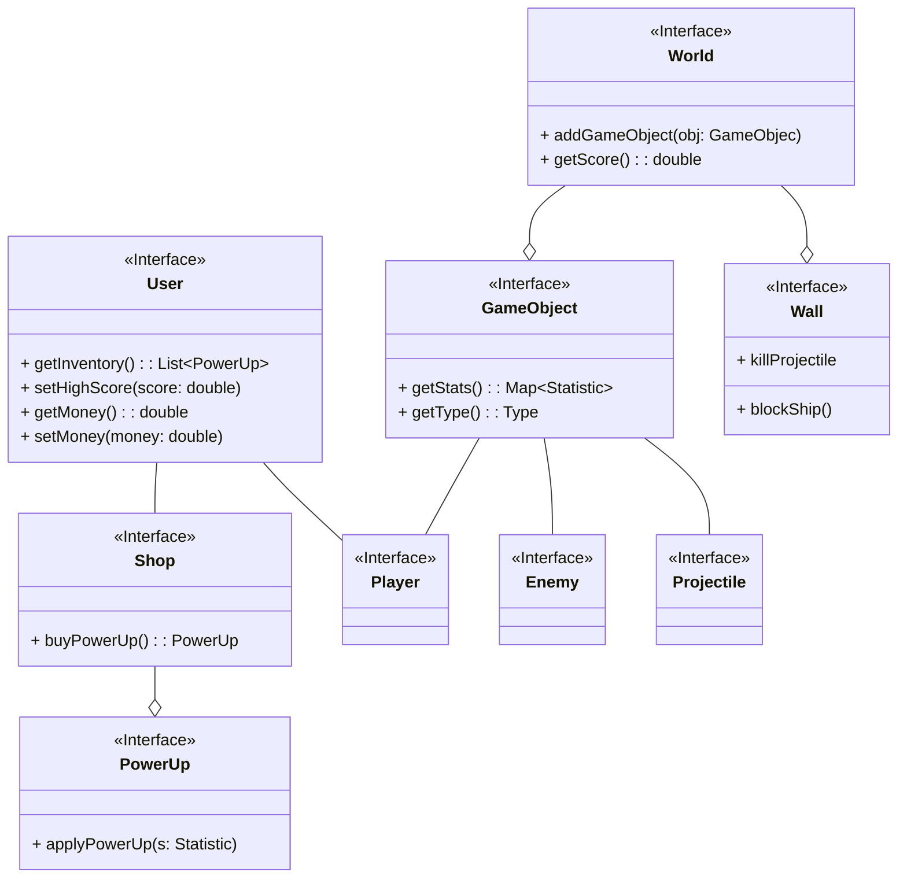
```mermaid
classDiagram
	class User{
		<<Interface>>
		+ getInventory(): List~PowerUp~
		+ setHighScore(score: double)
		+ getMoney(): double
		+ setMoney(money: double)
	}
	class PowerUp{
		<<Interface>>
		+ applyPowerUp(s: Statistic)
	}
	class Shop{
		<<Interface>>
		+ buyPowerUp(): PowerUp
	}
	class World{
		<<Interface>>
		+ addGameObject(obj: GameObjec)
		+ getScore(): double
	}
	class GameObject{
		<<Interface>>
		+ getStats(): Map~Statistic~
		+ getType(): Type
	}
	class Player{
		<<Interface>>
	}
	class Enemy{
		<<Interface>>
	}
	class Projectile{
		<<Interface>>
	}
	class Wall{
		<<Interface>>
		+ blockShip()
		+ killProjectile
	}
	World --o GameObject
	World --o Wall
	GameObject -- Player
	GameObject -- Enemy
	GameObject -- Projectile
	Shop --o PowerUp
	User -- Shop
	User -- Player
```

## Capitolo 2 - Design

### 2.1 Architettura

Come pattern architetturale abbiamo scelto l'MVC, che ci avrebbe permesso di scorporare la View dal resto, rendendo il progetto più estendibile, e che ci avrebbe aiutato a delineare i compiti delle varie classi. Non vi è una vera e propria classe Model; si può dire che le sue entità principali siano il World e l'AccountHandler. L'accesso al Controller invece è effettuato attraverso l'interfaccia Controller, il quale contiene la View (alla quale si accede per mezzo dell'interfaccia omonima) e GameSession, un controller di supporto creato per incapsulare insieme il model World e il GameLoop, che non hanno senso di esistere l'uno senza l'altro. 
Il Controller contiene anche un riferimento a AccountHandler, il model che gestisce la parte di login e registration dell'Account (un riferimento a quest'ultimo è contenuto anche nel Controller per non doverlo estrarre ogni volta). La View è dotata di uno SceneController, che abbiamo considerato parte di essa nonostante il nome poiché è specializzato per JavaFX; stessa cosa vale per gli InitController, che sono i controller inizializzati da JavaFX quando si usa FXML, dotati da noi di un'interfaccia per uniformarli. Il Controller chiama il cambio scena della View attraverso un metodo specializzato.

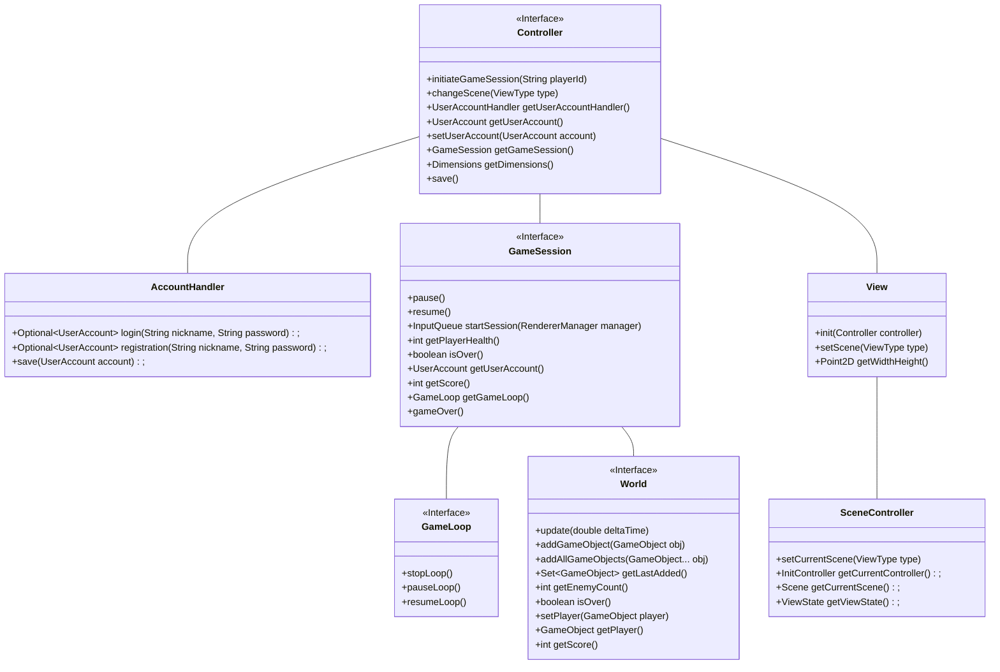
```mermaid
classDiagram

    class GameLoop {

        <<Interface>>

        +stopLoop()

        +pauseLoop()

        +resumeLoop()

    }

  

    class World {

        <<Interface>>

        +update(double deltaTime)

        +addGameObject(GameObject obj)

        +addAllGameObjects(GameObject... obj)

        +Set~GameObject~ getLastAdded()

        +int getEnemyCount()

        +boolean isOver()

        +setPlayer(GameObject player)

        +GameObject getPlayer()

        +int getScore()

    }

  

    class Controller {

        <<Interface>>

        +initiateGameSession(String playerId)

        +changeScene(ViewType type)

        +UserAccountHandler getUserAccountHandler()

        +UserAccount getUserAccount()

        +setUserAccount(UserAccount account)

        +GameSession getGameSession()

        +Dimensions getDimensions()

        +save()

    }

  

    class AccountHandler {

        +Optional~UserAccount~ login(String nickname, String password);

        +Optional~UserAccount~ registration(String nickname, String password);

        +save(UserAccount account);

    }

  

    class SceneController {

        +setCurrentScene(ViewType type)

        +InitController getCurrentController();

        +Scene getCurrentScene();

        +ViewState getViewState();

    }

  

    class GameSession {

        <<Interface>>

        +pause()

        +resume()

        +InputQueue startSession(RendererManager manager)

        +int getPlayerHealth()

        +boolean isOver()

        +UserAccount getUserAccount()

        +int getScore()

        +GameLoop getGameLoop()

        +gameOver()

    }

  

    class View {

        +init(Controller controller)

        +setScene(ViewType type)

        +Point2D getWidthHeight()

    }

  

    GameSession -- GameLoop

    GameSession -- World

    Controller -- GameSession

    Controller -- View

    Controller -- AccountHandler

    View -- SceneController

```

### 2.2 Design dettagliato 

#### Ginevra Bartolini

##### Realizzazione di PowerUp

**Problema:**  Dato l'utilizzo condiviso degli oggetti PowerUp da parte di ShopView e ShopModel, si è reso necessario realizzare un implementazione che distinguesse a dovere le parti limitando la ripetizione di codice. 

**Soluzione:**  Di conseguenza il concetto di PowerUp è stato diviso in due diverse classi, una ad uso della ShopView e una ad uso dello ShopModel. Questo permette di non appesantire lo ShopModel con informazioni che non lo concernono, come la descrizione o l'immagine del PowerUp. dall'altra parte questo permette al PowerUpRenderer di accedere alle informazioni di base per mezzo di un implementazione interna di PowerUp. Entrambi come successivamente spiegato sono caricati dallo ShopController.

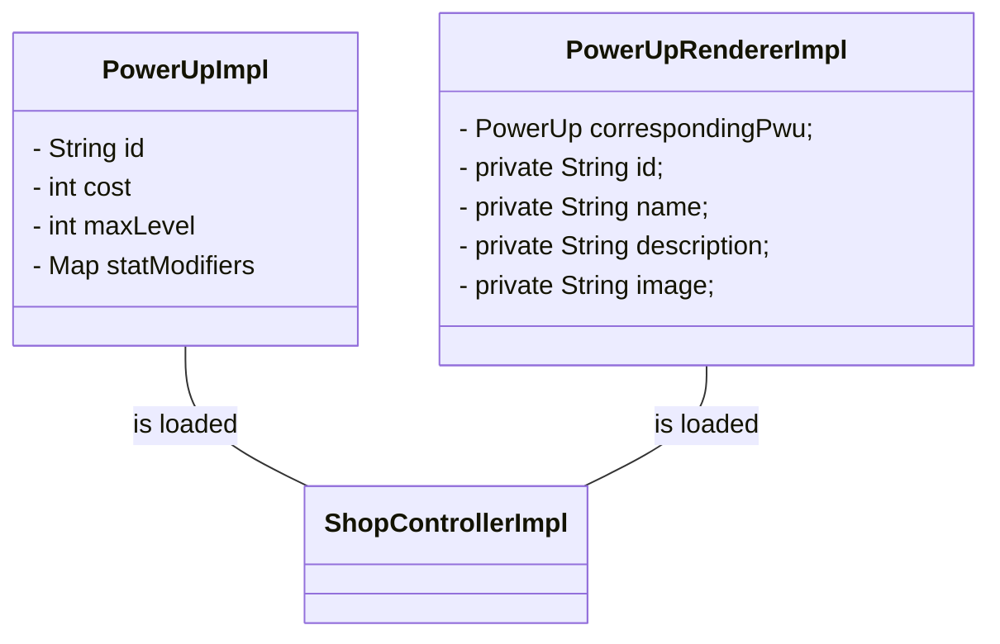
```mermaid
classDiagram

class PowerUpImpl {
	- String id
	- int cost
	- int maxLevel
	- Map<Statistic, Integer> statModifiers
}

class PowerUpRendererImpl {
	 - PowerUp correspondingPwu;
   - private String id;
   - private String name;
   - private String description;
   - private String image;
}

class ShopControllerImpl

PowerUpImpl --ShopControllerImpl  : is loaded
PowerUpRendererImpl --ShopControllerImpl  : is loaded
```

##### Shop

Lo ShopController si occupa di caricare le informazioni riguardanti i PowerUp e i PowerUpRenderer da due file di configurazione YAML. Queste informazioni sono necessarie per il corretto funzionamento del Model e della View dello Shop. 
La decisione di utilizzare dei file di configurazione per la creazione dei sopraddetti oggetti è stata presa in prospettiva di una possibile estendibilità dei PowerUp acquistabili nello shop. 

**Problema:** il caricamento di oggetti complessi per mezzo di file YAML, non potendo infatti utilizzare i tipi previsti dalla libreria esterna SnakeYaml, in quanto non in grado di rappresentare completamente oggetti di tipo PowerUp e PowerUpRenderer. 

**Soluzione:** Si sono implementati costruttori personalizzati e definiti i conseguenti PropertyParameters, come specificato nella documentazione di Snakeyaml. 
Questo permette un caricamento più semplice delle informazioni. 

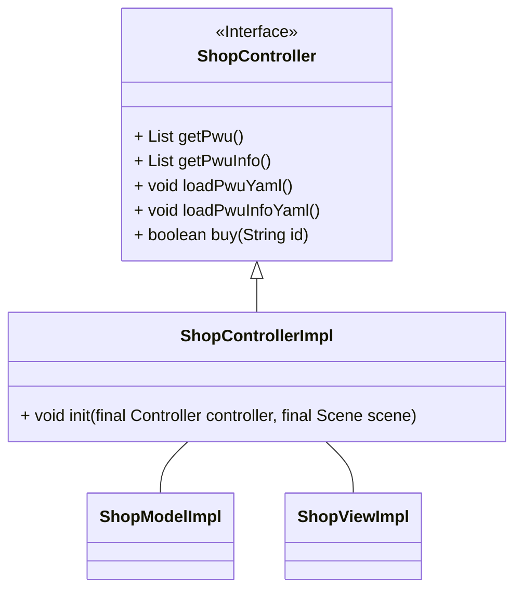
```mermaid
classDiagram
class ShopController { 
<<Interface>>
+ List<PowerUp> getPwu()
+ List<PowerUpRenderer> getPwuInfo()
+ void loadPwuYaml()
+ void loadPwuInfoYaml()
+ boolean buy(String id)
}

class ShopControllerImpl {
+ void init(final Controller controller, final Scene scene)
}

class ShopModelImpl
class ShopViewImpl

ShopController <|-- ShopControllerImpl
ShopControllerImpl -- ShopModelImpl 
ShopControllerImpl -- ShopViewImpl 
```

##### Account

**Problema:** In fase di progettazione ci siamo resi conto della necessità di salvare informazioni di gioco per ogni giocatore, per poter permettere la ripresa della partita. 

**Soluzione:** Questo ha richiesto di individuare quali informazioni salvare e in quale formato. In particolare si è prediletto un design della classe che permettesse di limitare la ripetizione di codice e la presenza di informazioni non utili all'account, che ha indotto al concetto di inventario e powerup da aggiungere. 
Nello specifico invece che salvare direttamente i power up comprati ogni volta, si sono selezionati i dati necessari, quali Id del power up, quante volte è stato comprato e statistiche da aggiungere alla nave, salvandoli in seguito in due diverse collezioni per permetterne un utilizzo debito. 

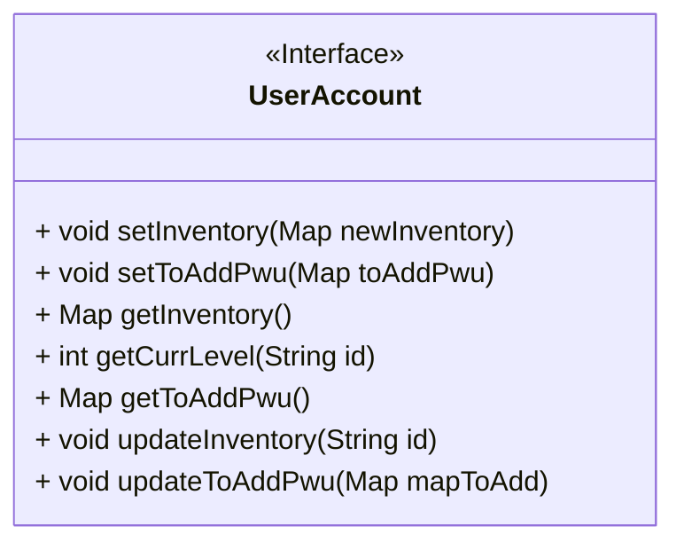
```mermaid
classDiagram
class UserAccount {
    <<Interface>>
    + void setInventory(Map<String, Integer> newInventory)
    + void setToAddPwu(Map<Statistic, Integer> toAddPwu)
    + Map<String, Integer> getInventory()
    + int getCurrLevel(String id)
    + Map<Statistic, Integer> getToAddPwu()
    + void updateInventory(String id)
    + void updateToAddPwu(Map<Statistic, Integer> mapToAdd)
}
```

##### Account

**Problema:** In fase di progettazione ci siamo resi conto della necessità di salvare informazioni di gioco per ogni giocatore, per poter permettere la ripresa della partita. 

**Soluzione:** Questo ha richiesto di individuare quali informazioni salvare e in quale formato. In particolare si è prediletto un design della classe che permettesse di limitare la ripetizione di codice e la presenza di informazioni non utili all'account, che ha indotto al concetto di inventario e powerup da aggiungere. 
Nello specifico invece che salvare direttamente i power up comprati ogni volta, si sono selezionati i dati necessari, quali Id del power up, quante volte è stato comprato e statistiche da aggiungere alla nave, salvandoli in seguito in due diverse collezioni per permetterne un utilizzo debito. 

```mermaid
classDiagram
class UserAccount {
    <<Interface>>
    + void setInventory(Map<String, Integer> newInventory)
    + void setToAddPwu(Map<Statistic, Integer> toAddPwu)
    + Map<String, Integer> getInventory()
    + int getCurrLevel(String id)
    + Map<Statistic, Integer> getToAddPwu()
    + void updateInventory(String id)
    + void updateToAddPwu(Map<Statistic, Integer> mapToAdd)
}
```

##### Account handler

**Problema:** In fase di sviluppo ho notato che permettere all'account di gestire al suo interno i metodi di registrazione, accesso e salvataggio, creava un problema di istanze. Il loader di YAML necessita di creare infatti un istanza dell'oggetto salvato nel file, in questo caso UserAccount. 

**Soluzione:** Si ha quindi optato per separare questi metodi in una classe UserAccountHandler che si occupasse appunto di tutto ciò sopra citato e dei conseguenti controlli, quali esistenza pregressa di un account e correttezza della password. 
Gli errori sono stati gestiti tramite l'utilizzo di Optional, che permette di ritornare un Optional.empty() in caso di un qualsiasi errore durante le operazioni. Gli errori sono poi specificati per l'utente nell'interfaccia di Login. Esempi di errore potrebbero essere una password errata o un tentativo di registrarsi con un nome di account già esistente.
Come sopra scritto sono stati creati anche in questo caso dei costruttori personalizzati per semplificare le interazioni fra programma e file di configurazione.

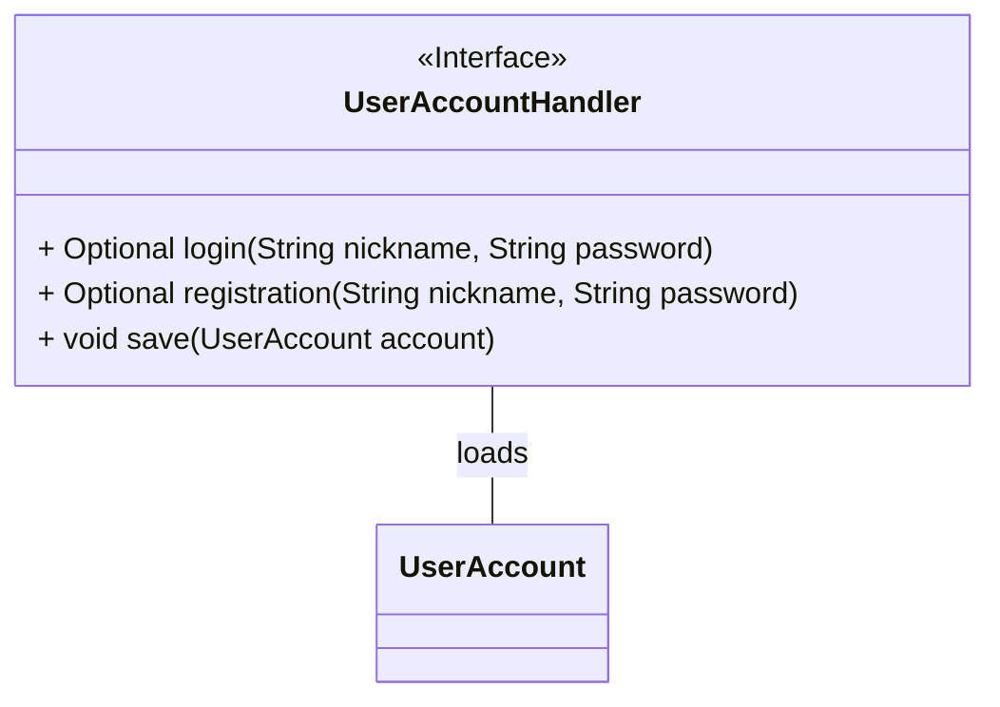
```mermaid
classDiagram
class UserAccountHandler {
	<<Interface>>
    + Optional<UserAccount> login(String nickname, String password)
    + Optional<UserAccount> registration(String nickname, String password)
    + void save(UserAccount account)
}
class UserAccount

UserAccountHandler -- UserAccount : loads
```

#### Giulia Bonifazi 

##### Come effettuare il render dei GameObject

**Problema**: Il Model e la View non possono interagire direttamente, ma serve un modo per mostrare sullo schermo le varie entità in gioco e aggiornare le statistiche sulla scena. 

**Soluzione**: L'interfaccia Renderable dota ogni classe che la implementa del metodo render(), chiamato ad ogni frame per aggiornare ciò che si vede sullo schermo. L'interfaccia Renderer è pensata per i GameObject, e permette che tipi diversi di oggetto siano renderizzati nello stesso modo. Il RendererManager è invece generico, dunque all'occorrenza si può implementare anche per classi diverse dal GameObject; il GameObjectRendererManager viene creato nel momento in cui il GameStageController dà il via alla partita, e contiene sia i Renderer che il GameStageController stesso, così che possa chiamare render() per tutti gli elementi interessati.
I GameObject vengono aggiunti al GameObjectRendererManager al momento dello spawn, grazie al fatto che anche il GameLoop ne contiene un riferimento, ma ciò non è visibile dall'UML qui sotto.
Ciascun renderer all'interno ha uno Sprite che al momento della creazione ricava l'immagine necessaria dal loader delle immagini e la cede al Painter, che la disegna. Nel caso del JFXCanvasPainter, viene disegnata su un Canvas. 

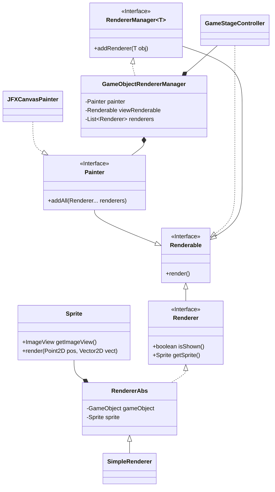
```mermaid
classDiagram

    class RendererManager~T~ {

        <<Interface>>

        +addRenderer(T obj)

    }

  

    class GameObjectRendererManager {

        -Painter painter

        -Renderable viewRenderable

        -List~Renderer~ renderers

    }

  

    class Renderable {

        <<Interface>>

        +render()

    }

  

    class Renderer {

        <<Interface>>

        +boolean isShown()

        +Sprite getSprite()

    }

  

    class RendererAbs {

        -GameObject gameObject

        -Sprite sprite

    }

  

    class Painter {

        <<Interface>>

        +addAll(Renderer... renderers)

    }

  

    class Sprite {

  

        +ImageView getImageView()

		+render(Point2D pos, Vector2D vect)

    }

  

    Renderable <|-- RendererManager

    RendererManager <|.. GameObjectRendererManager

	Sprite --* RendererAbs

    Renderable <|-- Renderer

    Renderer <|.. RendererAbs

    RendererAbs <|-- SimpleRenderer

    Painter --|>Renderable

    JFXCanvasPainter ..|> Painter

    GameObjectRendererManager *-- Painter

    GameStageController ..|> Renderable

    GameStageController --* GameObjectRendererManager
```

##### Gestione delle diverse routine di chiusura 

**Problema**: A causa del fatto che la routine di chiusura può essere impostata solo da Stage in JafaFX, è necessario trovare un modo di impostarla in modo agile e veloce. Le routine di chiusura, inoltre, non sono in corrispondenza biunivoca con le varie scene della view né con i casi dello SceneController, rendendo impossibile l'utilizzo di uno di essi a questo scopo.

**Soluzione**: L'utilizzo di uno state pattern, la cui gestione per la rotazione di stati spetta allo SceneController. Ogni ViewState viene inizializzato con un messaggio personalizzato, finalizzato alla creazione di un Alert il quale apparirà al momento della richiesta di chiusura. Ciascuno degli Stati implementa una propria versione della routine di chiusura una volta confermata la richiesta selezionando "OK" nell'Alert. L'utilizzo di questo pattern, oltre a risolvere i problemi sopra indicati, permette anche di aggiungere o togliere stati molto agevolmente. L'inizializzazione del ViewState viene fatta all'interno di View al momento del cambio di scena.

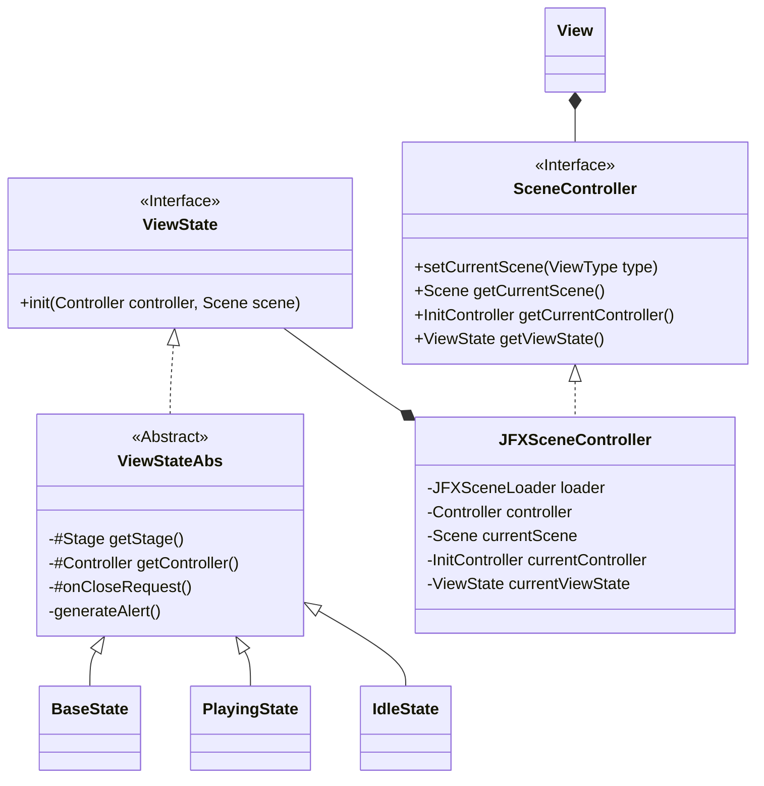
```mermaid
classDiagram

    class ViewState {

        <<Interface>>

        +init(Controller controller, Scene scene)

    }

  

    class ViewStateAbs {

        <<Abstract>>

        -#Stage getStage()

        -#Controller getController()

        -#onCloseRequest()

        -generateAlert()

    }

  

    class SceneController {

        <<Interface>>

        +setCurrentScene(ViewType type)

        +Scene getCurrentScene()

        +InitController getCurrentController()

        +ViewState getViewState()

    }

  

    class JFXSceneController {

        -JFXSceneLoader loader

        -Controller controller

        -Scene currentScene

        -InitController currentController

        -ViewState currentViewState

    }

  

    ViewState <|.. ViewStateAbs

    ViewStateAbs <|-- BaseState

    ViewStateAbs <|-- PlayingState

    ViewStateAbs <|-- IdleState

    SceneController <|.. JFXSceneController

    ViewState --* JFXSceneController

	View *-- SceneController
```

##### Gestione dello spawn dei nemici relativamente alla loro aggiunta nel World

**Problema**: C'è bisogno di un modo per gestire l'aggiunta e la rimozione di GameObject nel World senza correre il rischio di effettuarla in un momento inopportuno o di non eliminare correttamente alcune istanze "morte". Una sola collezione di oggetti non è sicuramente sufficiente.

**Soluzione**: Attraverso l'utilizzo di un Double Buffer, è possibile evitare entrambi i problemi descritti in precedenza. Il double buffer ha due collezioni, buffer e current, e fa in modo che le rimozioni e le aggiunte di GameObject avvengano sempre sul buffer, mentre l'update sempre sul current. Appena prima di iniziare la procedura di update, il "vecchio" buffer diventa current, e il "nuovo" buffer viene assegnato a una nuova collezione che contiene gli stessi elementi di current. Grazie all'utilizzo del tipo generico, il DoubleBuffer funziona anche per classi diverse dal GameObject, anche se all'interno di questo progetto è servito solo per il problema descritto sopra.

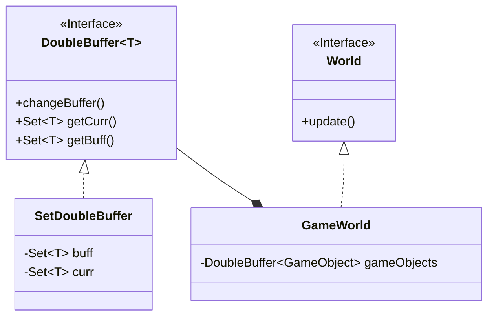
```mermaid
classDiagram
    class DoubleBuffer~T~ {
    
        <<Interface>>
        
        +changeBuffer()
        
        +Set~T~ getCurr()
        
        +Set~T~ getBuff()
        
    }
  
	DoubleBuffer <|.. SetDoubleBuffer
	
    class SetDoubleBuffer~T~ {
    
        -Set~T~ buff
        
        -Set~T~ curr
    }  

    class World {
    
        <<Interface>>
        
        +update()
    }

  

    World <|.. GameWorld
    
    DoubleBuffer --* GameWorld
    
    class GameWorld {
    
        -DoubleBuffer~GameObject~ gameObjects
    }
```

*L'interfaccia World e la classe GameWorld non sono rappresentate nella loro interezza, poiché non è necessario per la spiegazione della scelta di design attuale*

##### Cattura degli input durante la partita

**Problema**: Non si possono chiamare metodi del thread GameLoop mentre è in esecuzione, ma c'è bisogno di un modo per informarlo degli input del player così che possa mandare le informazioni al GameObject che rappresenta il giocatore.

**Soluzione**: Attraverso l'utilizzo di una BlockingQueue lievemente modificata, ispirata al pattern Producer-Consumer, in modo che gli elementi inseriti siano stringhe mentre quelli rimossi siano Input, gli Input vengono consegnati al player attraverso il GameLoop. Questa BlockingQueue, denominata InputQueue, viene restituita al controller della view di gioco quando esso ordina di far partire il GameLoop alla GameSession, che contemporaneamente la passa nel costruttore a GameLoopThread.

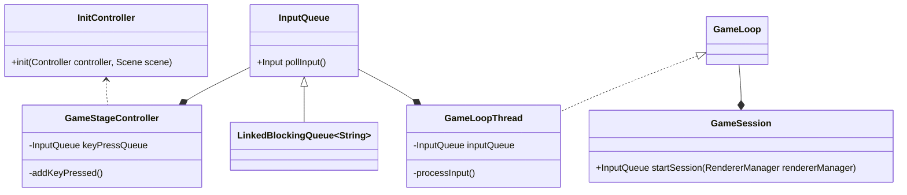
```mermaid
classDiagram

    class InputQueue {

        +Input pollInput()

    }

  

    class InitController {

        +init(Controller controller, Scene scene)

    }

    class GameStageController {

        -InputQueue keyPressQueue

        -addKeyPressed()

    }

  

    class GameLoopThread {

        -InputQueue inputQueue

        -processInput()

    }

    class GameSession {

        +InputQueue startSession(RendererManager rendererManager)

    }

  

    InputQueue --* GameStageController

    InitController <.. GameStageController

    GameLoop --* GameSession

    GameLoop <|.. GameLoopThread

    InputQueue --* GameLoopThread

    InputQueue <|-- LinkedBlockingQueue~String~
    
```

*Anche in questo UML le classi e le interfacce non sono rappresentate nella loro interezza, poiché ciò risulterebbe troppo confusionario e non aiuterebbe la comprensione della soluzione sopra spiegata*

##### Creazione dei confini del World

**Problema**: Serve un modo per creare i confini del World, che per natura pur essendo GameObject non hanno bisogno di Renderer e non richiedono statistiche né id. Crearne quattro nel GameWorld risulta spiacevole alla vista e difficile da leggere.

**Soluzione**: Un builder per i Wall fornisce un default GameObject che ha solo le caratteristiche indispensabili per un Wall, e non è più richiesto inserire ogni volta i parametri che andrebbero ripetuti (il vettore nullo della velocità e il tipo dell'HitboxComponent, per esempio). Il codice è più leggibile, più digeribile e presenta anche una maggiore estendibilità, poiché il WallBuilder è dotato di un metodo che permette di settare il GameObject in modo diverso da quello default, nel caso in cui si volesse aggiungere in un futuro un muro spinato o una barriera elettrica (e dunque servisse una stat di danno).

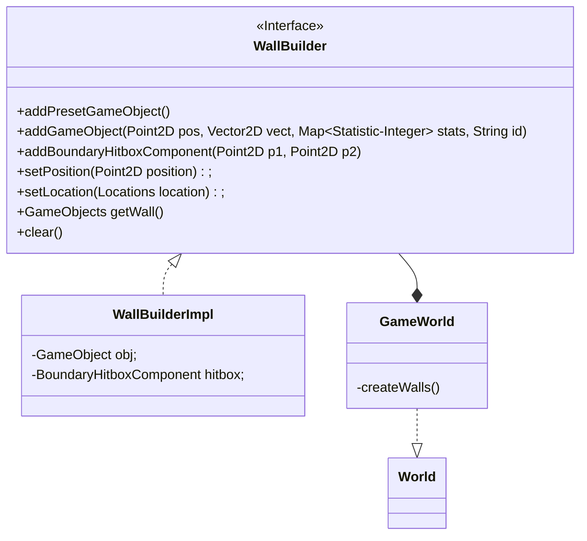
```mermaid
classDiagram

    class WallBuilder {

        <<Interface>>

        +addPresetGameObject()

        +addGameObject(Point2D pos, Vector2D vect, Map~Statistic-Integer~ stats, String id)

        +addBoundaryHitboxComponent(Point2D p1, Point2D p2)

        +setPosition(Point2D position);

        +setLocation(Locations location);

        +GameObjects getWall()

        +clear()

    }

  

    class WallBuilderImpl {

        -GameObject obj;

        -BoundaryHitboxComponent hitbox;

  

    }

  

    GameWorld ..|> World

    class GameWorld {

        -createWalls()

    }

  

    WallBuilder <|.. WallBuilderImpl

    WallBuilder --* GameWorld
```

#### Sezione condivisa tra Foschini Galileo e Alessio Lizza

Questa sezione comprende una parte condivisa tra Galileo Foschini e Alessio Lizza. La suddivisione originale del lavoro comprendeva la divisione tra il concetto di player e nemico, ma durante lo sviluppo abbiamo deciso che questa divisione non era necessaria a livello di classi. Abbiamo quindi aggiunto questa sezione per spiegare le decisioni di design condivise tra le nostre parti.

**Problema**: Il codice deve avere una grande estendibilità. In particolare deve essere possibile aggiungere o cambiare GameObject con meno modifiche al codice possibili.

**Soluzione**:Creando una classe per ogni Player e Nemico avremmo avuto molte ripetizioni di codice, in quanto sono concettualmente molto simili. La soluzione che abbiamo applicato è il pattern Type Object che consiste nel dare ad ogni GameObject una classe che ne definisca le statistiche. In questo modo semplicemente mettendo una classe diversa possiamo modellare due navi differenti.

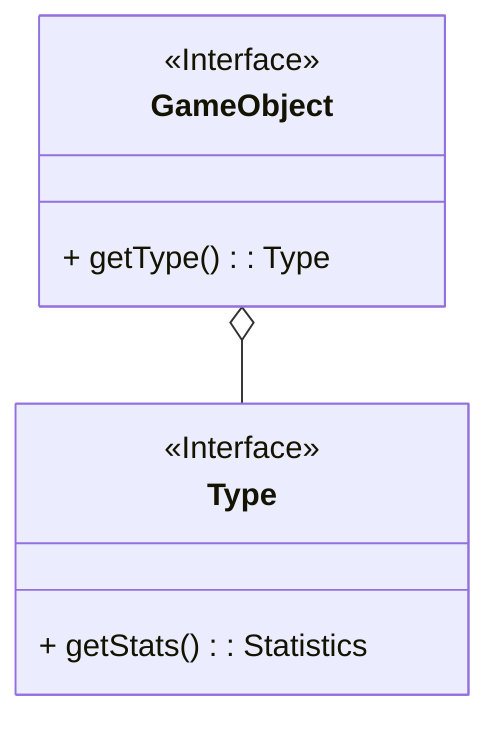
```mermaid
classDiagram
	class GameObject{
		<<Interface>>
		+ getType(): Type
	}
	class Type{
		<<Interface>>
		+ getStats(): Statistics
	}
	GameObject o-- Type
```

**Problema**: I GameObject sono molto simili tra di loro, per esempio tra un player ed un enemy cambia solamente il tipo di input, ciò può portare ad un codice molto ripetitivo.

**Soluzione**: Abbiamo deciso quindi di applicare il pattern Component separando le funzionalità base di ogni GameObject e permettendoci di cambiarne il comportamento semplicemente sostituendo uno dei suoi componenti.
Implementando il Component pattern per cambiare l'input basta cambiare InputComponent. Questa soluzione non solo permette una grande estendibilità, ma divide anche i vari comportamenti del codice in classi a se stanti.

Incorporando i pattern Component e Type Object abbiamo potuto creare navi completamente differenti semplicemente cambiando il Type.

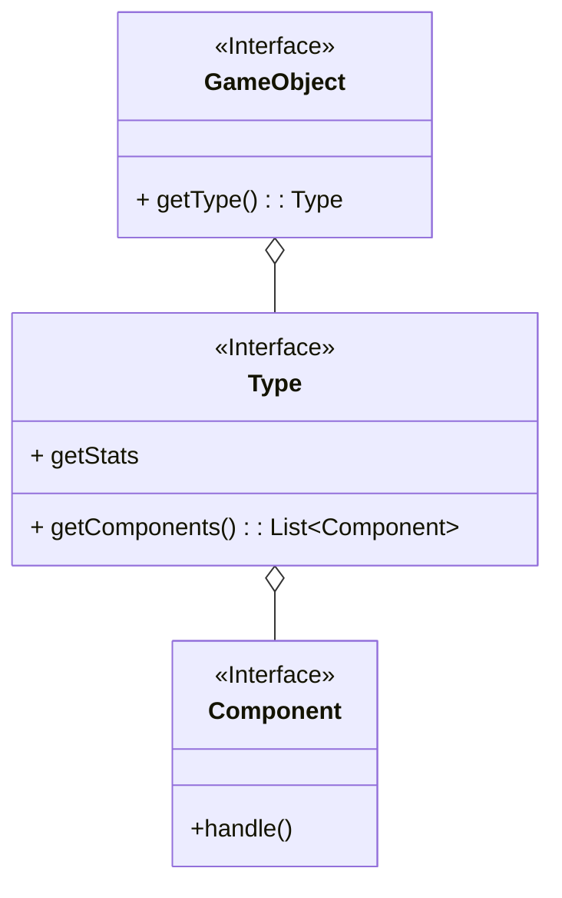
```mermaid
classDiagram
	class GameObject{
		<<Interface>>
		+ getType(): Type
	}
	class Type{
		<<Interface>>
		+ getComponents(): List~Component~
		+ getStats
	}
	class Component{
		<<Interface>>
		+handle()
	}
	GameObject o-- Type
	Type o-- Component
```

**Problema**: Gli oggetti di gioco devono avere una serie di funzioni che vengono eseguite ad ogni ciclo del GameLoop. Ciò potrebbe portare a scarsa estendibilità se progettato incorrettamente.

**Soluzione**: Si è applicato l'Update pattern creando un metodo update in ogni GameObject e Component. Esso viene chiamato ad ogni frame dal GameLoop e descrive le operazioni che l'oggetto deve eseguire. Per esempio il GameObject Nave deve chiamare l'update di tutti i suoi component, poi se necessario deve curarsi di un determinato valore, oppure l'InputComponent deve muovere il GameObject in base alla propria logica interna.

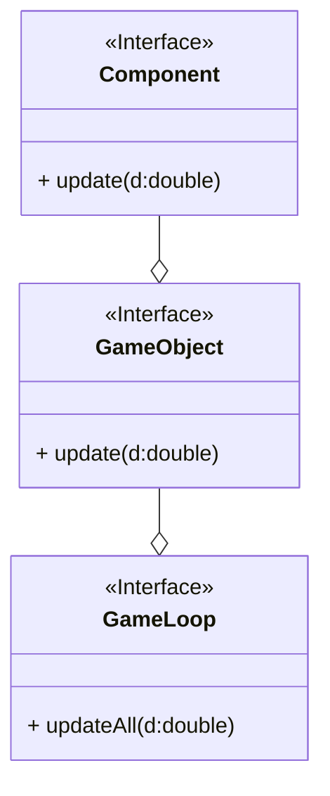
```mermaid
classDiagram
	class GameLoop{
		<<Interface>>
		+ updateAll(d:double)
	}
	class GameObject{
		<<Interface>>
		+ update(d:double)
	}
	class Component{
		<<Interface>>
		+ update(d:double)
	}
	GameObject --o GameLoop
	Component --o GameObject
```

#### Galileo Foschini

##### Component

**Problema**: Per sfruttare al meglio il Component pattern è necessario che i component abbiano delle funzioni comuni, ma al col tempo devono poter essere distinti tra le loro tipologie se necessario. In oltre molte parti sarebbero comuni portando a numerose ripetizioni di codice.

**Soluzione**: Definiamo i comportamenti comuni tra i vari component utilizzando un'interfaccia Component che viene implementata da ogni Component, facendo estendere ad ogni singola interfaccia di un tipo di Component le classi possono decidere di lavorare su un tipo specifico o su Component e comunque le funzioni base sarebbero implementate. Per evitare ripetizioni di codice implementiamo una classe astratta di Component che definisce tutti le funzioni base, che verrà poi estesa da tutti i Component.
Aspetto Fondamentale di questa struttura è che diviene possibile mettere in un GameObject un numero indefinito di tipi di Component pur potendo accedere ad ogni tipo singolarmente. Questo significa che è possibile aggiungere nuovi Component indipendentemente da quali sono già dentro all'oggetto.

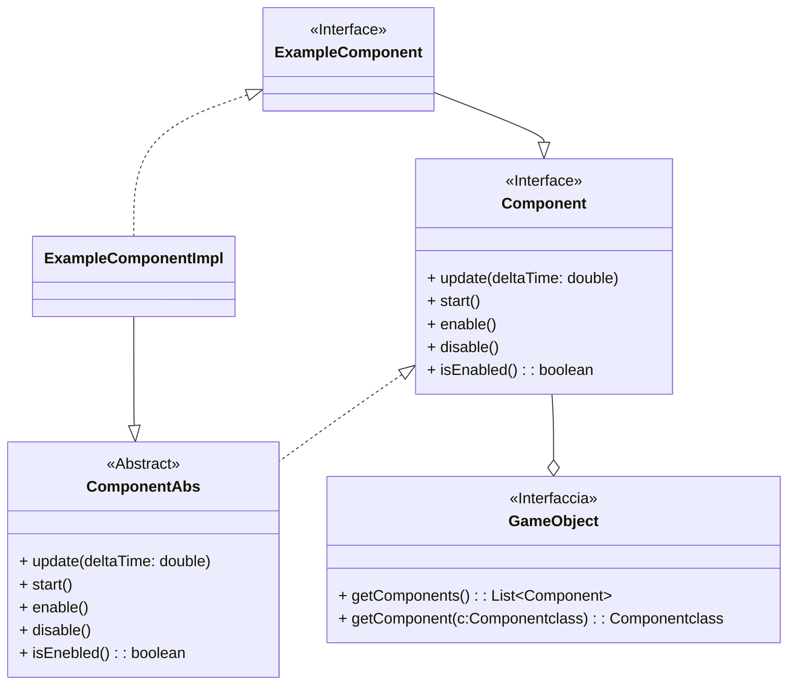
```mermaid
classDiagram
	class Component{
		<<Interface>>
		+ update(deltaTime: double)
		+ start()
		+ enable()
		+ disable()
		+ isEnabled(): boolean
	}
	class ComponentAbs{
		<<Abstract>>
		+ update(deltaTime: double)
		+ start()
		+ enable()
		+ disable()
		+ isEnebled(): boolean
	}
	class ExampleComponent{
		<<Interface>>
	}
	class ExampleComponentImpl{
	}
	class GameObject{
		<<Interfaccia>>
		+ getComponents(): List~Component~
		+ getComponent(c:Componentclass): Componentclass
	}
	Component <|.. ComponentAbs
	ExampleComponent --|> Component
	ExampleComponentImpl --|> ComponentAbs
	ExampleComponent <|.. ExampleComponentImpl
	Component --o GameObject
```

##### ShooterComponent

**Problema**: Si vuole fare in modo che uno shooterComponent non sia direttamente legato al proiettile che spara, In oltre si vuole evitare che un Component abbia un collegamento diretto con il World.

**Soluzione**: Impostando gli ShooterComponent in modo che accettino un Supplier di proiettili si elimina la necessità di impostare il proiettile dentro al Component, permettendo una maggiore estendibilità. In oltre il compito di immettere il proiettile nel GameWorld è delegato al Supplier, per evitare che vi sia un riferimento al World dentro a un Component.

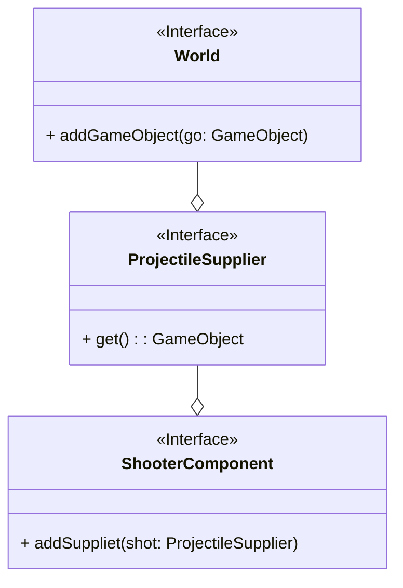
```mermaid
classDiagram
	class ShooterComponent{
		<<Interface>>
		+ addSuppliet(shot: ProjectileSupplier)
	}
	class ProjectileSupplier{
		<<Interface>>
		+ get(): GameObject
	}
	class World{
		<<Interface>>
		+ addGameObject(go: GameObject)
	}
	ProjectileSupplier --o ShooterComponent
	World --o ProjectileSupplier
```

##### Creazione delle navi

**Problema**: Considerando un futuro mantenimento dell'applicazione, vogliamo che le modifiche alle statistiche e ai comportamenti delle navi comportino la minore modifica del codice possibile.

**Soluzione**: Sfruttando i pattern Type Object e Component è possibile definire un GameObject dalle statistiche e dai component che possiede. Caricando queste informazioni da file al posto di scriverle direttamente sul codice non solo diventa più facile modificare le caratteristiche di una nave, ma è possibile modificarle senza dover ricompilare il codice.

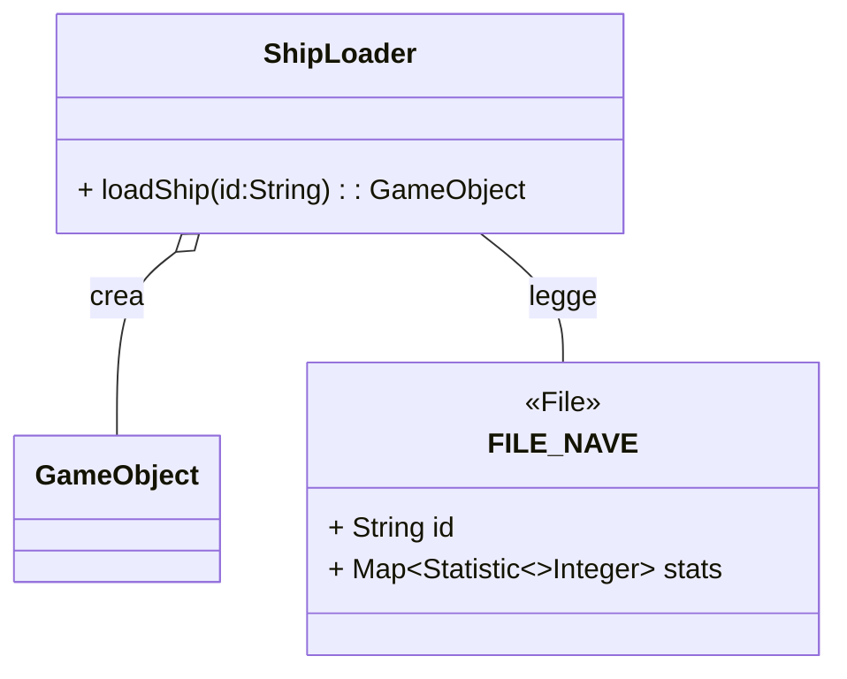
```mermaid
classDiagram
	class ShipLoader{
		+ loadShip(id:String): GameObject
	}
	ShipLoader o-- GameObject : crea
	class FILE_NAVE{
		<<File>>
		+ String id
		+ Map~Statistic~~Integer~ stats
	}
	ShipLoader -- FILE_NAVE : legge
```

**Problema**: Ogni qualvolta viene caricata una nave bisogna darle i giusti Component con i giusti valori.

**Soluzione**: Una possibile soluzione sarebbe di collegare ad ogni component un identificatore e tradurre i dati letti da file tramite una factory di Component. Tuttavia considerando questa soluzione ogni volta che si vuole aggiungere un nuovo Component al gioco bisognerebbe modificare la factory.
La soluzione applicata prende ispirazione dal pattern Bytecode: creando una serie di notazioni standard che vengono lette da un'apposito metodo è possibile costruire i Component tramite reflection senza passare da una factory. Per far funzionare tale metodo serve imporre alcuni limiti sulla costruzione di component, per esempio devono avere un singolo costruttore, ma permette di aggiungere component senza modificare alcuna classe, per aggiungerlo ad una nave è sufficiente aggiungerlo al file della nave e impostare i giusti parametri per il costruttore.

**Problema**: Si nota che i GameObject possono essere creati a partire solamente da un file, allora si vorrebbe poter aggiungere una nuova nave per intero senza ricompilare il codica

**Soluzione**: Creando un ulteriore file da cui ricavare gli id dei player e nemici, in questo modo è possibile aggiungere una nave nuova semplicemente creando il file e modificando il file della lista, anche senza ricompilare il Codice. Purtroppo questa tecnica non permette di aggiungere nuovi component senza ricompilare il programma questa situazione sarebbe tecnicamente risolvibile utilizzando un pattern Bytecode completo, tuttavia data la complessità del pattern e dal tempo necessario per implementarlo, esso non era una soluzione plausibile per questo progetto.

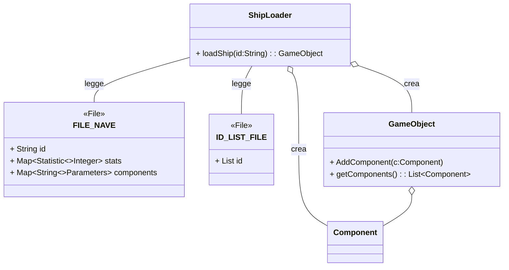
```mermaid
classDiagram
	class ShipLoader{
		+ loadShip(id:String): GameObject
	}
	class FILE_NAVE{
		<<File>>
		+ String id
		+ Map~Statistic~~Integer~ stats
		+ Map~String~~Parameters~ components
	}
	class ID_LIST_FILE{
		<<File>>
		+ List<String> id
	}
	class GameObject{
		+ AddComponent(c:Component)
		+ getComponents(): List~Component~
	}
	ShipLoader o-- GameObject : crea
	ShipLoader -- ID_LIST_FILE: legge
	ShipLoader -- FILE_NAVE : legge
	ShipLoader o-- Component : crea
	GameObject o-- Component
```

##### Caricamento delle immagini in memoria

**Problema**: Le immagini sono file molto pesanti da caricare in memoria, se venisse caricata un immagine per ogni GameObject in mappa la view rischierebbe di appesantirsi troppo e bloccarsi.

**Soluzione**: La soluzione più semplice è fare in modo che ogni immagine venga caricata solo una volta e venga riutilizzata ogni volta. L'imageLoader carica le immagini solo quando viene richiesta la prima volta, in modo da non caricare informazioni inutili, poi la salva su una mappa in modo che alla chiamata successiva restituisca la stessa immagine.

```mermaid
classDiagram
	class ImageLoader{
		- Map~String~~Image~ imageMap
		+ loadImage(id:String): Image
	}
	class IMAGE_FILE{
		<<File>>
	}
	class Image{
		(from JavaFx)
	}
	ImageLoader o-- Image
	ImageLoader -- IMAGE_FILE: legge
```
#### Alessio Lizza

##### Come effettuare le collisioni tra gli oggetti

**Problema**: All'interno dell'ambito del gioco, emerge l'esigenza che gli oggetti interagiscano mediante collisioni, generando risposte differenziate in base alla natura di tali interazioni. 

**Soluzione**: Al fine di affrontare tale questione, si è deciso di adottare il pattern architetturale noto come "Component" - come già discusso nella sezione dedicata - per la creazione di componenti correlati alle aree di rilevamento delle collisioni in questo caso delle hitbox. A ogni oggetto è assegnato un hitbox component, esistono diversi component della hitbox e ognuno di essi sa come deve reagire alla collisioni sapendo a chi è stato assegnato e con chi l'oggetto sta collidendo. Un aspetto fondamentale di questa soluzione risiede nella presenza di due ampie interfacce che raggruppano tutte le possibili varianti dei componenti hitbox, quelle lineari che sono utilizzate per i bordi della mappa e quelle circolari che vengono utilizzate per tutti gli oggetti del gioco, navi e proiettili, quest'ultime possono avere comportamenti particolari come ad esempio quella del bomber che si autoinfligge del danno oppure se si possono comportare in maniera semplice. L'approccio delineato agevola notevolmente l'espansione del programma in quanto rende agevole l'aggiunta di elementi nuovi e diversificati. Si rende sufficiente la creazione di una nuova tipologia di hitbox personalizzata qualora sia richiesta una reazione particolare, oppure è possibile impiegare una delle tipologie di hitbox già implementate per generare nuovi oggetti, il tutto senza necessità di intervenire sulla base di codice preesistente.

```mermaid
classDiagram 
	class HitboxComponent{ 
		<<Interface>> 
		+ getType(): Type
		+ canCollide(): 
		+ isColliding(): 
	} 
	class BoundaryHitboxComponent{ 
		<<Interface>> 
		+ setLocations(): 
		+ getLine(): Line2D 
	} 
	class CircleHitboxComponentAbs{ 
		<<Interface>> 
		+ getCircle(): Circle2D 
		+ setPosition(): 
		+ update(): 
	} 
	HitboxComponent --o BoundaryHitboxComponent 
	HitboxComponent --o CircleHitboxComponentAbs
```

##### Come far muovere i nemici

**Problema**: All'interno del contesto del gioco, sorge la necessità di conferire ai nemici la capacità di muoversi secondo logiche predefinite.

**Soluzione**: Anche in questa circostanza, si è fatto ricorso all'impiego del pattern architetturale Component per la creazione di componenti volti a definire i comportamenti dei nemici. Tale approccio ha comportato la realizzazione di componenti specifici, ognuno dei quali determina un comportamento particolare che viene attuato dai nemici durante lo svolgimento del gioco e basa i movimenti del nemico sulla posizione del player che viene settato all'interno di ogni nemico come target, ossia chi i nemici devono puntare. Il comportamento effettivo, cioè come i 3 tipi di nemici (sniper, tank, bomber) si muovono è implementato per ognuno di essi. Il concetto di estensibilità del programma, simile a quanto già realizzato per i componenti delle hitbox, trova riscontro anche in questa parte del codice. Nell'eventualità in cui sia richiesto l'impiego di un comportamento già presente nel codice, esso può essere riutilizzato, ma nel caso in cui si desideri introdurre un nuovo comportamento, è possibile sviluppare un nuovo componente senza apportare alcuna modifica al codice già esistente.

```mermaid
classDiagram
	class InputComponent{
		<<Interface>>
	}
	class EnemyInputComponent{
		<<Interface>>
		+ setTarget():
	}
	class InputComponentBomberImpl{
		+ calculateMovement(): Vector2D
		+ update():
	}
	class InputComponentTankImpl{
		+ calculateMovement(): Vector2D
		+ update():
	}
	class InputComponentSniperImpl{
		+ calculateMovement(): Vector2D
		+ update():
	}
InputComponent --o EnemyInputComponent
EnemyInputComponent--o InputComponentBomberImpl
EnemyInputComponent--o InputComponentTankImpl
EnemyInputComponent--o InputComponentSniperImpl
```

##### Come generare i nemici e in maniera graduale farli diventare più forti

**Problema**: Nel gioco, emerge la necessità di generare nemici in intervalli temporali specifici e di potenziarli gradualmente man mano che la partita avanza.

**Soluzione**: Per affrontar questo problema é stato creato un enemySpawner (generatore di nemici) il cui compito è quello di generare nemici ogni lasso di tempo predefinito inoltre ha il compito di incrementare le loro statistiche in base a quanto tempo è passato dall'inizio della partita, per farlo crea un powerUp component speciale in base al tempo della partita e lo assegna al nemico prima di aggiungerlo nel mondo. Anche in questo caso il metodo di generazione dei nemici si basa su un meccanismo di caricamento da file, dove i nemici sono definiti in un elenco con identificatori univoci. Lo spawner utilizza queste informazioni per generare nemici pseudo-casuali in base agli ID. Questo significa che le modifiche o l'aggiunta di nuovi nemici non richiedono modifiche dirette al codice dello spawner che sarà in grado di adattarsi autonomamente alle nuove situazioni senza richiedere riscritture.

```mermaid
classDiagram
	class EnemySpawner{
		<<Interface>>
		+ getEnemy(): GameObject
		+ getStats(): HashMap<Statistic, Integer>
		+ update():
	}
	class EnemySpawnerImpl{
		+ getIdentifier(): String
	}
	
	EnemySpawner --o EnemySpawnerImpl
```
## Capitolo 3 - Sviluppo

### 3.1 Testing automatizzato

Il testing automatizzato ha riguardato in particolar modo la parte logica dell'applicazione. I test sono stati eseguiti seguendo un approccio bottom-up, a partire dai singoli component; è stato testato il funzionamento di alcuni component e il caricamento da file YAML, tutte le classi di utility della geometria, gli spawn del player e dei nemici e la logica dello shop. Particolare attenzione è stata dedicata al testing del login e della creazione di nuovi account.

Per la scrittura dei test è stata utilizzata la suite di Junit5. 

### 3.2 Metodologia di lavoro

Durante il primo mese dopo la proposta del progetto, il gruppo si è consultato regolarmente per decidere come strutturarlo e come delimitare le diverse parti. Mentre in principio, essendo le classi Player e EnemyShip pensate come separate, è risultato quasi ovvio dichiarare le due parti "implementazione del Player" e "implementazione di EnemyShip", andando avanti con la progettazione si sono uniformate fino a non richiedere più una distinzione tanto netta; i due responsabili di queste due parti dunque si sono trovati a lavorare a più stretto contatto l'uno con l'altro sin dalla progettazione. Conclusa la fase di pianificazione, ci siamo dedicati alla fase di lavoro individuale con parti così divise:

- **Ginevra Bartolini:** implementazione di ShopView, ShopModel e ShopController. Lettura dei PowerUp da file yaml e implementazione degli stessi. Implementazione di Account e AccountHandler.

- **Giulia Bonifazi:** implementazione del GameLoop, gestione della View per quanto riguarda il cambio di scena e del Controller. Implementazione del World e del GameWorld e classi ad esso associate, escluse quelle relegate allo spawn di oggetti. Implementazione dei Renderer.

-  **Galileo Foschini**: implementazione di tutto il lato dedicato al player dei Component, gestione degli Input, ImageLoader per evitare di caricare immagini nuove ad ogni frame. Implementazione delle tre classi di player. Implementazione dello spawner del player e delle classi ad esso associate.

- **Alessio Lizza**: implementazione di tutto il lato dedicato all'Enemy dei component. Implementazione del GameObject e dell'EnemySpawner. Implementazione in particolare dell'HitboxComponent in tutte le sue varianti.

Una volta stabilita questa divisione, è stato creato un repository di Git seguendo le specifiche consigliate dal professore e si è proceduto con lo sviluppo. Dopo aver committato e pushato sul branch principale quelle che dovevano essere le interfacce necessarie all'eventuale collegamento tra le classi sviluppate in parallelo, abbiamo cominciato a lavorare ognuno per conto suo. Quando lo sviluppo di una feature sembrava richiedere modifiche troppo ingenti per essere introdotta nel branch principale, veniva creato un branch secondario in cui svilupparla a parte fino a quando non fosse assolutamente necessaria o fino al completamento. 

Dopo che ciascuno di noi ha completato quanto possibile della propria parte in solitaria, ci siamo ritrovati più volte per far combaciare al meglio i pezzi che avevamo prodotto, informandoci a vicenda nel caso si rendesse necessaria l'aggiunta di un metodo o di un campo a una classe. Un esempio di questa procedura si può trovare nel conteggio dei nemici presenti in gioco, una delle  aggiunte al GameWorld fatta nelle ultime fasi di sviluppo; essa si è resa necessaria dopo che abbiamo insieme notato che data la sessione di gioco infinita, un player molto agile ma con mira carente avrebbe potuto portare a una quantità eccessiva di entità sullo schermo.

Oggetto di discussione di gruppo sono stati il modo per far equipaggiare i PowerUp al player, come inizializzare ciascuna scena (data la scelta di non utilizzare FXML di alcuni membri, è stato necessario adattare JFXSceneController ad ogni casistica possibile). I Component sono stati maneggiati in coppia da Lizza e Foschini, così come i GameObject (sebbene l'implementazione di questi ultimi fosse riservata a Lizza come specificato in precedenza), ed essendo i due principali utilizzatori di tale interfaccia hanno dovuto confrontarsi parecchio sull'argomento.  Ci si è dovuti accordare anche su come aggiungere gli spawner in modo che funzionassero correttamente, correggendo il tiro e rimaneggiando alcune classi secondo necessità.

#### Ginevra Bartolini

In autonomia mi sono occupata di:

- Implementazione di PowerUp, cioè oggetti che rappresentano aumenti delle statistiche della nave. 

- Implementazione di metodi di caricamento da file YAML della configurazione dei PowerUp, e delle loro informazioni. 

- Creazione di un'interfaccia di Shop, che funge da negozio per eventuali acquisti di PowerUp, e della conseguente meccanica di acquisto. 

- Realizzazione di UserAccount e del conseguente Handler. 

- Implementazione di metodi si registrazione, login e salvataggio di UserAccount tramite funzioni di caricamento da file YAML. 

- Implementazione della schermata di tutorial.

In collaborazione ho lavorato: 

- Con Giulia Bonifazi, accordi minori riguardanti la view e come integrare la sua ShopView.

- con Galileo Foschini: sulla logica retrostante ai meccanismi dello Shop. Nello specifico come meglio strutturarlo per limitare le entrate nei file di configurazione e la ripetizione di codice. 

- con Alessio Lizza: sulla logica retrostante ai meccanismi dello Shop (per le specifiche, vedi commento soprastante); sulla realizzazione di un'interfaccia di accesso, concordando sui metodi necessari.

#### Giulia Bonifazi
In autonomia mi sono occupata di:

- Creazione delle interfacce Controller e View e delle relative implementazioni. Modifica del progetto in modo che tutta l'applicazione iniziasse nel Thread di JavaF, per consentire il "disegno" sulla view. 

- Creazione delle interfacce GameSession, World, GameLoop e relative implementazioni. Implementazione di InputQueue per catturare gli input, di DoubleBuffer e relative implementazioni per agevolare l'update del GameWorld, implementazione di CollisionHandler e relative per controllo collisioni a ogni frame attraverso metodo ricorsivo per non controllare ogni elemento più di una volta. Creazione di Dimensions e ArenaDimensions.

- Implementazione finale di WallBuilder e WallBuilderImpl.

- View del GameStage e relativo Controller. Interfaccia ControllerInit.

- Creazione di Render, Renderable e RendererManager e implementazioni. Creazione di Painter, SceneController e SceneLoader e implementazioni. Creazione della classe Sprite. Implementazione del meccanismo di cambio scena e cambio ViewState, implementazione di ViewState e relative estensioni.

In collaborazione mi sono occupata di:

- Con Alessio Lizza, prima aggiunta di Wall (senza builder) utilizzando il suo BoundaryHitboxComponent, set up dell'EnemySpawner nel GameLoopThread (apportate modifiche soprattutto relative a quali parametri erano necessari per la creazione dello spawner) e vari accordi su metodi per gestire cambio scena nella sua implementazione di ControllerInit.

- Con Ginevra Bartolini, accordi minori riguardanti la view e come integrare la sua ShopView.

- Con Galileo Foschini, aggiunta del player al GameWorld attraverso il suo sistema di spawner, recupero set di enemy tags per il controllo dell'attribuzione dello score alla morte di un'entità, caricamento immagini per mezzo di un ImageLoader, accordi minori riguardanti la view.

#### Galileo Foschini

In autonomia mi sono occupato di:

- Creazione delle classi riguardanti la geometria 2D (del package alienenterprises.model.geometry), che sono alla base di tutti i movimenti dei GameObject in mappa e del funzionamento delle hitbox;

- Creazione dell'implementazione base dei Component e creazione dei component riguardanti il player e i proiettili, tra cui gli ShooterComponent;

- Creazione di ShipLoader e ShipInfoLoader che hanno il compito di caricare le navi e le loro informazioni in memoria;

- Creazione di ImageLoader che ha il compito di collegare l'id di un GameObject con il file dello sprite da utilizzare e le informazioni necessarie per visualizzarlo;

- Creazione del menu di selezione della nave e del suo controller(PlayerController, PlayerClassMenuImpl).

- Creazione della classe Installer, che imposta la cartella locale del programma.

In collaborazione mi sono occupato di:

- Con Ginevra Bartolini: Logica dello shop e dei powerUp, in particolare sul come limitare le letture da file e come integrare i powerUp con i funzionamenti del player.

- Con Giulia Bonifazi: Aggiunta del player e dei Proiettili al GameWorld, caricamento degli sprite tramite un ImageLoader. Passaggio di informazioni riguardanti gli identificatori del player e dei nemici, per calcolo dello score. Accordi minori riguardanti la view.

- Con Alessio Lizza: Amministrazione dei GameObject e dei component, in quanto parte integrante di entrambe le parti.

#### Alessio

In autonomia mi sono occupata di:

- Implementazione di game object, tutti gli oggetti presenti dentro la mappa di gioco: navicelle, bordi, proiettili;

- Implementazione degli input dei nemici, cioè come i nemici si comportano all'interno del gioco:

- Implementazioni delle hitbox, tutti gli oggetti occupano uno spazio e nel caso in cui si sovrappongono cosa deve succedere;

- Implementazione dello spawner dei nemici, un oggetto che genera i nemici ogni dopo un tempo ben definito, aumentando la forza di essi con il passare del tempo;

- Implementazione delle schermate di view di login e registrazione;

- Implementazione dei controller per la view di login e registrazione, cosa deve avvenire quando la persona clicca i pulsanti;

- Implementazione della schermata di menu principale, con il relativo controller che ha il compito di cambiare la schermata in base al pulsante cliccato;

Ho collaborato con:

- Giulia:
    - sul funzionamento dello spawner dei nemici perchè era essenziale avere un controllo accurato sulla generazione dei nemici nel mondo di gioco per evitare un elevato numero di nemici in mappa e per garantire un flusso equilibrato concordando sui metodi di cui entrambi avevamo bisogno
    - sulla creazione dei bordi della mappa, infatti ho creato una hitbox particolare per quest’ultimi.
- Galileo:
    - sulla parte del game object perchè entrambi avevamo bisogno di creare degli oggetti con determinate caratteristiche da mettere nella mappa.
    - sui component perchè per fare un gioco il più estendibile possibile avevamo bisogno che i component fossero il più possibile riutilizzabili.
- Ginevra
    - Abbiamo concordato sui metodi necessari per avere accesso alle informazioni dell’account del giocatore dai file, in modo da avere un accesso coerente e controllato ai dati necessari per il gioco.

### 3.3 Note di sviluppo

#### Ginevra Bartolini
- Uso di Lambda Expression: Usate frequentemente, più volte con stream, for each o ActionListener. Segue un solo esempio: 

https://github.com/xAle24/OOP22-alienent/blob/25a5565e0a892dc11008a258fb75a36ca1d8f893/src/main/java/it/unibo/alienenterprises/model/UserAccountImpl.java#L153

- Uso di Stream più volte. Segue un solo esempio: 

https://github.com/xAle24/OOP22-alienent/blob/25a5565e0a892dc11008a258fb75a36ca1d8f893/src/main/java/it/unibo/alienenterprises/model/ShopModelImpl.java#L47
 
- Uso di Optional: Usati frequentemente. Segue un solo esempio:

https://github.com/xAle24/OOP22-alienent/blob/25a5565e0a892dc11008a258fb75a36ca1d8f893/src/main/java/it/unibo/alienenterprises/model/UserAccountHandlerImpl.java#L42

- Uso della libreria esterna SnakeYaml: Usata frequentemente, nello specifico nelle implementazioni delle classi UserAccountHandler e ShopController. Segue un solo esempio:

https://github.com/xAle24/OOP22-alienent/blob/25a5565e0a892dc11008a258fb75a36ca1d8f893/src/main/java/it/unibo/alienenterprises/controller/ShopControllerImpl.java#L114

Immagini di sfondo per vari elementi della GUI: https://crusenho.itch.io/complete-gui-essential-pack 

Immagini di sfondo per vari PowerUp: https://quintino-pixels.itch.io/free-pixel-art-skill-icons-pack 

Immagine di sfondo per varie schermate: https://unsplash.com/it/foto/Oze6U2m1oYU 

Immagine di sfondo per l'inventario: https://admurin.itch.io/free-chest-animations 

Immagini utilizzate per la schermata di tutorial: https://joshuajennerdev.itch.io/pixel-keys-x16 

immagine per i bottoni di uscita: https://kenney.nl/assets/game-icons

Font "80's Retro Future", utilizzato nella schermata di tutorial: https://ninjikin.itch.io/a-font-for-the-future-that-never-existed-80s-retro-future-font 

Immagine del lucchetto per il pulsante di login: https://kenney.nl/assets/game-icons

#### Giulia Bonifazi

- Uso di tipi generici in DoubleBuffer e in RendererManager. Permalink:

https://github.com/xAle24/OOP22-alienent/blob/25a5565e0a892dc11008a258fb75a36ca1d8f893/src/main/java/it/unibo/alienenterprises/model/util/DoubleBuffer.java#L12

- Uso di lambda expression in molteplici casi. Di seguito un esempio:

https://github.com/xAle24/OOP22-alienent/blob/25a5565e0a892dc11008a258fb75a36ca1d8f893/src/main/java/it/unibo/alienenterprises/model/world/GameWorld.java#L57

- Uso di Stream più volte e di Optional in CollisionHandler. Un esempio del primo e unico esempio del secondo:

https://github.com/xAle24/OOP22-alienent/blob/25a5565e0a892dc11008a258fb75a36ca1d8f893/src/main/java/it/unibo/alienenterprises/model/collisionhandler/CollisionHandlerAbs.java#L44

https://github.com/xAle24/OOP22-alienent/blob/25a5565e0a892dc11008a258fb75a36ca1d8f893/src/main/java/it/unibo/alienenterprises/model/collisionhandler/CollisionHandlerAbs.java#L64

- Uso della libreria JavaFX per l'implementazione della View. Permalink:

https://github.com/xAle24/OOP22-alienent/blob/25a5565e0a892dc11008a258fb75a36ca1d8f893/src/main/java/it/unibo/alienenterprises/view/javafx/JFXSceneLoader.java#L24

Soprattutto nelle fasi intermedie del progetto, ho utilizzato come "aiuto" nei punti ostici questo progetto meritevole:

https://bitbucket.org/danysk/oop17-burattini-samuele-ciarafoni-nicholas-dente-francesco/src/master/

Il codice dei metodi di rotazione dello sprite proviene da questo link:

https://stackoverflow.com/questions/18260421/how-to-draw-image-rotated-on-javafx-canvas

#### Galileo Foschini

- Utilizzo reflection.
	- Permalink: https://github.com/xAle24/OOP22-alienent/blob/f9b014943befa70ee5342116366d4e5a50aadef3/src/main/java/it/unibo/alienenterprises/controller/ShipLoaderImpl.java#L170C7-L170C7
- Utilizzo di Yaml tramite la libreria snakeyaml in molteplici classi.
	- Un esempio: https://github.com/xAle24/OOP22-alienent/blob/f9b014943befa70ee5342116366d4e5a50aadef3/src/main/java/it/unibo/alienenterprises/view/javafx/ImageLoaderImpl.java#L38
- Utilizzo di Optional in molteplici classi.
	- Un esempio: https://github.com/xAle24/OOP22-alienent/blob/f9b014943befa70ee5342116366d4e5a50aadef3/src/main/java/it/unibo/alienenterprises/view/javafx/PlayerInfoLoaderImpl.java#L92
- Utilizzo di Stream in molteplici classi.
	- Un esempio: https://github.com/xAle24/OOP22-alienent/blob/874c86e41b348b15c8cb1c54f68c7a01b4a514fa/src/main/java/it/unibo/alienenterprises/controller/ShipLoaderImpl.java#L177
- Utilizzo di LambdaExpression in molteplici classi.
	- Un esempio: https://github.com/xAle24/OOP22-alienent/blob/874c86e41b348b15c8cb1c54f68c7a01b4a514fa/src/main/java/it/unibo/alienenterprises/view/PlayerClassMenuImpl.java#L154

Per l'implementazione base del Component ho leggermente modificato quella presente nel seguente progetto:
https://bitbucket.org/danysk/oop17-burattini-samuele-ciarafoni-nicholas-dente-francesco/src/master/
Da cui ho anche preso qualche spunto per altre classi come lo ShooterComponent.

Per l'implementazione dell'installer ho preso quella presente nel seguente progetto:
https://github.com/Martinetto33/OOP22-tafl-games/blob/main/src/main/java/taflgames/Installer.java

Le immagini riguardanti le classi del player: [https://foozlecc.itch.io/void-fleet-pack-1](https://foozlecc.itch.io/void-fleet-pack-1 "https://foozlecc.itch.io/void-fleet-pack-1")

Lo sprite del proiettile: [https://opengameart.org/content/sci-fi-space-simple-bullets](https://opengameart.org/content/sci-fi-space-simple-bullets "https://opengameart.org/content/sci-fi-space-simple-bullets")
#### Alessio Lizza

- Uso di lambda expressions e uso di stream molteplici volte, qui un esempio: [https://github.com/xAle24/OOP22-alienent/blob/33bf5b97de00c72e3ea73834a9ce7ecb4b2742de/src/main/java/it/unibo/alienenterprises/model/EnemySpawnerImpl.java#L58C1-L58C1](https://github.com/xAle24/OOP22-alienent/blob/33bf5b97de00c72e3ea73834a9ce7ecb4b2742de/src/main/java/it/unibo/alienenterprises/model/EnemySpawnerImpl.java#L58C1-L58C1)

- Uso di optional moltelici volte, qui un esempio: [https://github.com/xAle24/OOP22-alienent/blob/3c4fa7719ae65aeffbf4da62dd9f02dc0aa41287/src/main/java/it/unibo/alienenterprises/model/impl/components/InputComponentBomberImpl.java#L51](https://github.com/xAle24/OOP22-alienent/blob/3c4fa7719ae65aeffbf4da62dd9f02dc0aa41287/src/main/java/it/unibo/alienenterprises/model/impl/components/InputComponentBomberImpl.java#L51)

- Uso di JavaFX in tutti i controller delle view e di FXML per i layout, qui un esempio di entrambi: JavaFX: [https://github.com/xAle24/OOP22-alienent/blob/3c4fa7719ae65aeffbf4da62dd9f02dc0aa41287/src/main/java/it/unibo/alienenterprises/view/controllers/LoginControllerImpl.java#L40](https://github.com/xAle24/OOP22-alienent/blob/3c4fa7719ae65aeffbf4da62dd9f02dc0aa41287/src/main/java/it/unibo/alienenterprises/view/controllers/LoginControllerImpl.java#L40) FXML: [https://github.com/xAle24/OOP22-alienent/blob/3c4fa7719ae65aeffbf4da62dd9f02dc0aa41287/src/main/resources/layouts/login.fxml#L8](https://github.com/xAle24/OOP22-alienent/blob/3c4fa7719ae65aeffbf4da62dd9f02dc0aa41287/src/main/resources/layouts/login.fxml#L8)

Link a parti di codice esterne e risorse utilizzate:

metodo default nella classe gameObject: [https://bitbucket.org/danysk/oop17-burattini-samuele-ciarafoni-nicholas-dente-francesco/src/master/](https://bitbucket.org/danysk/oop17-burattini-samuele-ciarafoni-nicholas-dente-francesco/src/master/)

immagine di sfondo delle schermate della view: https://unsplash.com/it/foto/Oze6U2m1oYU

sprite delle navi dei nemici: [https://foozlecc.itch.io/void-fleet-pack-2](https://foozlecc.itch.io/void-fleet-pack-2)

immagine del lucchetto nella view di login e registration: https://kenney.nl/assets/game-icons

## Capitolo 4 - Commenti finali

### 4.1 Autovalutazione e lavori futuri

#### Ginevra Bartolini

Nel complesso devo dirmi soddisfatta del mio lavoro. Non perchè sia spettacolare, ma per le cose che sono riuscita ad imparare nel mentre. Ho iniziato il progetto con conoscenze di Java un po' scarse, motivo per cui in tutta onestà ammetto di aver scelto di implementare una parte più semplice delle altre. 
Nel tempo trascorso a lavorare sul progetto ha aumentato le mie capacità e le mie conoscenze, anche di elementi non strettamente connessi a Java.
Sono contenta del livello di confidenza che sono riuscita a raggiungere con le librerie di java e con elementi più complessi, come Stream o Lambda. 
Credo anche che il mio contributo sia stato secondario ai fini dell'applicazione, in quanto essa potrebbe funzionare anche senza.  
Un altro rammarico è il non aver speso più tempo a rendere pulito e chiaro il codice dello shopView. Ammetto di comprendere cosa avrei potuto sistemare, cosa che ritengo un buon traguardo nonostante tutto. 

#### Giulia Bonifazi

Nel complesso, sono soddisfatta del lavoro svolto. Sebbene scrivendo la versione finale della relazione mi sia accorta che alcune classi potevano essere strutturate in modo molto più estendibile, non penso di aver fatto un lavoro di qualità scadente. Non sono però stata capace di valutare quanto lavoro mi spettava, e mi sono trovata con un carico forse eccessivo rispetto agli altri membri del gruppo; inoltre, nella fase di progettazione, l'inesperienza ci ha portato a sottovalutare di gran lunga la complessità di ciò che avremmo dovuto creare, cosa che ha avuto ripercussioni sul tempo di consegna e sullo sviluppo in generale, portando a frequenti riprogettazioni. Penso però che se dovessi rifare qualcosa di questo genere, sarei molto più preparata di come ero quando ho iniziato questo progetto, e sarei quindi capace di evitare o almeno mitigare la maggior parte dei problemi sopra elencati.

Ho acquisito conoscenze che mi saranno utili in futuro, volendo intraprendere la strada dello sviluppo di videogiochi anche in ambito professionale, se ciò mi sarà possibile. Questo è stato uno dei motivi che mi ha spinto a scegliere di farmi assegnare il GameLoop, dato che con gli strumenti moderni è uno degli aspetti che mi sarebbe rimasto oscuro ancora per qualche tempo.

#### Galileo Foschini

Nel complesso sono soddisfatto del risultato che siamo riusciti ad ottenere. Il lavoro di gruppo è stato sicuramente faticoso, ma anche formativo. Questa esperienza mi ha insegnato l'importanza della progettazione, infatti nonostante ci fossimo impegnati moltissimo in questa parte verso la conclusione del progetto le nostre lacune si sono fatte sentire. Questo progetto penso rispecchi bene quello che potrebbe essere un effettivo progetto lavorativo, almeno per quanto riguarda organizzazione e lavoro di gruppo.

Le conoscenze che ho acquisito con questo progetto mi saranno molto utili in futuro, soprattutto nel mondo lavorativo visto che sono interessato anche all'ambito dello sviluppo di videogiochi. In generale penso che un'esperienza del genere sia estremamente formativa per qualsiasi ingegnere informatico.
#### Alessio Lizza

Nel complesso mi sento soddisfatto di come ho lavorato nel progetto, ho imparato veramente come si lavora in un gruppo perchè era il primo progetto importante su cui ho lavorato ed è questo quello che mi sento di aver imparato maggiormente, infatti tutte le paure che avevo prima di fare questo progetto come ad esempio non saper da che parte iniziare perchè ci sono tante cose da implementare tutte dipendenti le une dalle altre, ora sono notevolmente diminuite perchè ho capito come devo comportarmi. Nel tempo trascorso a fare questo progetto ho inoltre capito come strutturare un progetto complesso che rispetti dei pattern ben precisi. Sono soddisfatto inoltre che sono andato oltre gli elementi che ci sono stati spiegati a lezione, ad esempio per JavaFX apprendendo quindi nuove cose ma soprattutto imparando come porsi davanti a un problema di cui sappiamo poco, nel mio caso l'uso dei file FXML. La fase che più mi ha messo alla prova è stata quella di analisi e su questo ho un'autocritica da farmi perchè penso di essermi impegnato tanto in questa fase ma avrei potuto fare di meglio, perchè vedendo come ora sono andate le cose ho notato come si poteva fare meglio e avrei voluto averci pensato subito in modo tale da risparmiare tempo e farne risparmiare ai miei compagni.

### 4.2 Difficoltà incontrate e commenti per i docenti

#### Giulia Bonifazi

Nonostante io riconosca le mie mancanze, rimane il fatto che questo progetto, essendo molto complesso e non contenendo, a conti fatti, niente di familiare per lo studente che si approccia ad esso dopo il corso, richiede una quantità di lavoro enorme: nelle 40-50 ore citate nelle istruzioni non sono previste le ore spese a ricercare e tentare di capire come svolgere compiti che a lezione sono sì stati toccati, ma in modo veloce e sbrigativo. Il lavoro con Git svolto durante i laboratori, sempre in proprio e sempre con pochi file e due o tre pacchetti al massimo, non è sufficiente a preparare per quella che a metà del lavoro sembra veramente un'impresa titanica. Inoltre, il tempo dedicato a prepararsi per il progetto e a svolgerlo è tempo che o viene sottratto allo studio per altri corsi, che quindi passano in secondo piano, o al riposo, portando in entrambi i casi a conseguenze spiacevoli per gli studenti. Una sola lezione sulla struttura di un semplice videogioco non basta a capire cosa realmente sia necessario tenere in considerazione quando se ne progetta uno più complesso, soprattutto dato che nella suddetta non vi è utilizzo di alcun pattern architetturale, richiesto invece per questo.

#### Galileo Foschini

Ritengo che il progetto per quanto interessante ed avvincente, richieda un po' troppo tempo per essere eseguito durante un anno universitario. Detto questo credo che il problema sia semplicemente nelle scadenze che cadono o in mezzo agli esami o subito dopo, rendendo difficile dedicare al progetto tutto il tempo di cui avrebbe bisogno. Inoltre ritengo che gli strumenti necessari per la corretta esecuzione del codice andrebbero spiegati a lezione in modo più approfondito.

## Appendice A - Guida per l'utente

Il login o la registrazione sono obbligatori per accedere a Alienent. Si fa presente che è necessario avviare il gioco sul proprio monitor principale, a causa del metodo con cui vengono creati i confini del mondo.

Si usa WASD per muoversi, P per mettere in pausa, SPAZIO per sparare.
Non è possibile uscire dal gioco senza salvare, il salvataggio è automatico.

## Appendice B - Esercitazioni di Laboratori

### B.0.1: [alessio.lizza@studio.unibo.it](mailto:alessio.lizza@studio.unibo.it)

- Laboratorio 3: [38482-423719/2022: Consegna lab03 (unibo.it)](https://virtuale.unibo.it/mod/forum/discuss.php?d=112846#p168207)
- Laboratorio 5: [38482-423719/2022: Consegna lab05 (unibo.it)](https://virtuale.unibo.it/mod/forum/discuss.php?d=114647#p170364)
- Laboratorio 9: [38482-423719/2022: Consegna lab09 (concorrenza) (unibo.it)](https://virtuale.unibo.it/mod/forum/discuss.php?d=118995#p175524)
- Laboratorio 10: [38482-423719/2022: Consegna lab10 (lambda/stream) (unibo.it)](https://virtuale.unibo.it/mod/forum/discuss.php?d=119938#p176649)